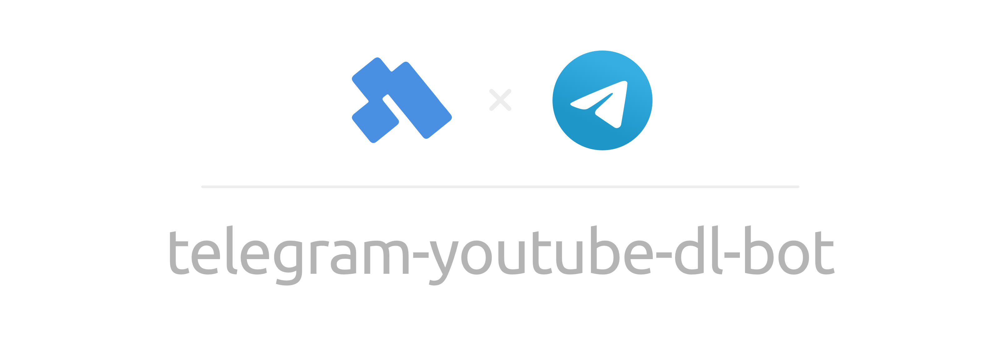

<p align="center">
  
</p>

This bot lets you extract video urls from a provided url. I am not hosting this bot myself, because I don't want be held responsable for any videos that might get requested through this bot.

To run your own version just run the following docker command and pass your bot token:

```sh
docker run\
  -e TELEGRAM_BOT_TOKEN='YOUR-TOKEN-HERE'\
  -d\
  ghcr.io/kuhltime/telegram-youtube-dl-bot:latest
```
